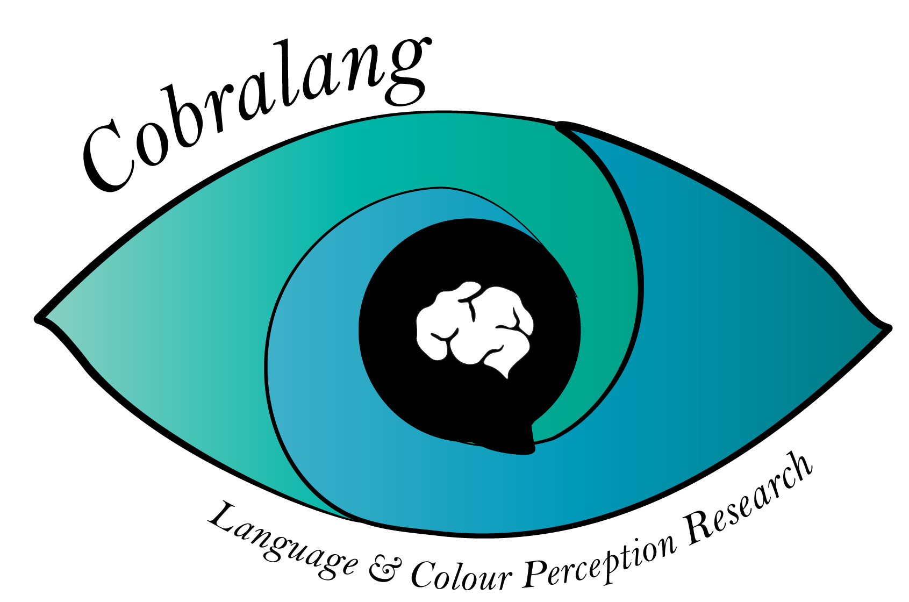
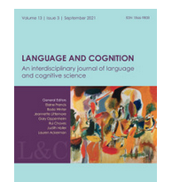

For the first paper of my PhD project, together with Monique Flecken, I reviewed more than 70 experimental papers on the effect of language on the perception of colour. I am very happy that this paper has now been published!

{style="float: right; margin-left: 20px;" width="185"}

{style="float: left; margin-right: 20px;"}

In this paper, I focused on how the choices of experimental approaches in previous experimental work on language-perception interactions affected their experimental findings...

We found a number of experimental contexts in which colour-perception interactions were more or less likely to occur...

Kapelle, O., & Flecken, M. (2025). Perceiving colour through a language lens: A scoping review of experimental work on effects of language on colour perception. *Language and Cognition.*
